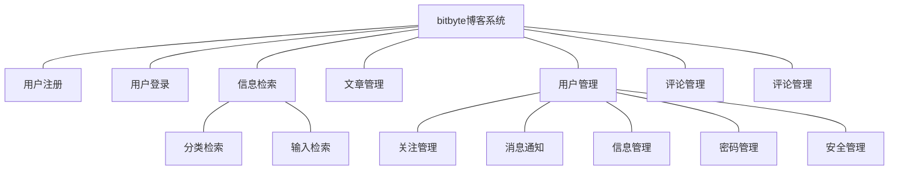

# 
bitbyte-web

   

## 1.系统概述

本系统是一个专门为 IT 从业人员和 IT 技术爱好者服务的的博客网站,用户在注册本网站登录后,可以在网站里浏览和发布计算机相关的文章,以及进行评论与作者进行交流反馈。

## 2. 功能模块

```mermaid
graph TB
    s[bitbyte博客系统]
    s --- 用户注册;
    s --- 用户登录;
    s --- search[信息检索];
    search --- 分类检索;
    search --- 输入检索;
    s --- article[文章管理];
    s --- user[用户管理];
    s --- com[评论管理];
    user --- sub[关注管理];
    user --- 消息通知;
    user --- 信息管理;
    user --- 密码管理;
    user --- 安全管理;
    s --- 评论管理;
```

